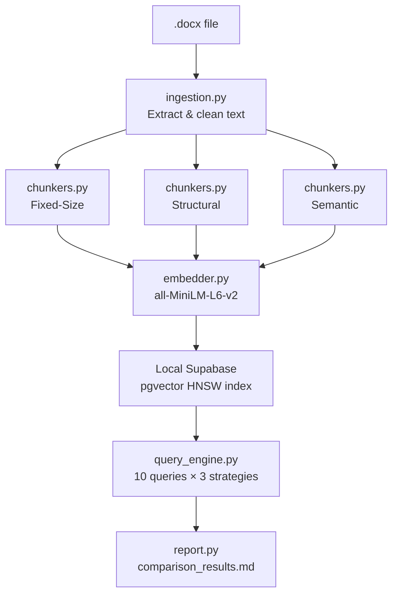

# RAG Pipeline Implementation Plan
## W03 Meta-Prompting Playbook — Kiro IDE Edition

---

## Problem Statement

Run the full 3-stage meta-prompting playbook (plan → build → evaluate) entirely
within Kiro IDE, using a local `.docx` document, local Supabase via Docker, and
Sentence-Transformers for embeddings — building a working RAG comparison pipeline
from scratch on a Windows machine.

---

## Requirements

- Full 3-stage playbook execution in Kiro IDE
- Docker Desktop installed (not yet present) as the local Supabase runtime
- `.docx` input document (under 20 pages)
- Sentence-Transformers (`all-MiniLM-L6-v2`, 384 dimensions) — fully local, no API keys
- 3 chunking strategies: fixed-size, structural, semantic
- 10 semantic queries run against all 3 strategies
- Final markdown comparison table written to file

---

## Background

| Topic | Decision |
|---|---|
| Vector index | HNSW (`m=16, ef_construction=64`) — correct for small docs; IVFFlat needs 100k+ vectors |
| Embedding model | `all-MiniLM-L6-v2` — 384 dims, ~22MB, Apache 2.0, fast on CPU |
| Similarity metric | Cosine similarity via `<=>` operator; `normalize_embeddings=True` in encoder |
| Supabase query pattern | RPC Postgres function — supabase-py ORM doesn't support vector operators directly |
| Chunking differentiation | Target visibly different chunk counts: ~fixed=many small, structural=section-sized, semantic=variable |
| Ground-truth metric | Top-1 cosine similarity as proxy (honest given no pre-existing labels) |

---

## Architecture



---

## Project Structure

```
rag-pipeline/
├── .env                        # SUPABASE_URL, SUPABASE_SERVICE_KEY
├── requirements.txt
├── supabase/
│   └── migrations/
│       └── 001_init.sql        # pgvector, table DDL, HNSW index, RPC function
├── ingestion.py                # .docx extraction and cleaning
├── chunkers.py                 # 3 chunking strategies
├── embedder.py                 # encode + insert into Supabase
├── query_engine.py             # embed query + call match_documents RPC
├── queries.py                  # 10 evaluation queries (defined by user)
├── evaluate.py                 # run all queries, save results.json
├── report.py                   # produce comparison_results.md
└── comparison_results.md       # final output
```

---

## Dependencies

```txt
supabase==2.4.0
python-docx==1.1.0
sentence-transformers==2.7.0
torch==2.2.2          # use CPU wheel: --index-url https://download.pytorch.org/whl/cpu
numpy==1.26.4
tabulate==0.9.0
python-dotenv==1.0.1
```

---

## Task Breakdown

### Task 1: Install Docker Desktop and verify WSL2 backend

**Objective:** Get Docker running on Windows as the foundation for local Supabase.

**Implementation:**
- Download Docker Desktop from https://www.docker.com/products/docker-desktop
- During install, enable WSL2 backend (Settings → General → Use WSL2 backend)
- Run `docker run hello-world` to verify

**Test:** `docker ps` returns without error.

**Demo:** Terminal shows Docker is running and responsive.

---

### Task 2: Install Supabase CLI and initialize local project

**Objective:** Set up the local Supabase project folder and pull all Docker images.

**Implementation:**
```bash
npm install -g supabase
mkdir rag-pipeline && cd rag-pipeline
supabase init
supabase start   # first run pulls ~1.5GB of images
supabase status  # copy API URL, anon key, service key
```

**Test:** `supabase status` prints API URL (`http://localhost:54321`), DB URL, and keys.

**Demo:** Supabase Studio accessible at `http://localhost:54323` in browser.

---

### Task 3: Create database schema and HNSW index via migration

**Objective:** Enable pgvector and create the `documents` table with a 384-dim vector column, HNSW index, and RPC search function.

**Migration file:** `supabase/migrations/001_init.sql`
```sql
-- Enable pgvector
CREATE EXTENSION IF NOT EXISTS vector;

-- Documents table
CREATE TABLE documents (
    id          BIGSERIAL PRIMARY KEY,
    content     TEXT NOT NULL,
    embedding   VECTOR(384),
    metadata    JSONB
);

-- HNSW index (build after inserts for best quality)
CREATE INDEX ON documents
USING hnsw (embedding vector_cosine_ops)
WITH (m = 16, ef_construction = 64);

-- Similarity search RPC
CREATE OR REPLACE FUNCTION match_documents(
    query_embedding VECTOR(384),
    match_threshold FLOAT,
    match_count     INT,
    strategy_filter TEXT DEFAULT NULL
)
RETURNS TABLE (id BIGINT, content TEXT, metadata JSONB, similarity FLOAT)
LANGUAGE SQL STABLE AS $$
    SELECT id, content, metadata,
           1 - (embedding <=> query_embedding) AS similarity
    FROM documents
    WHERE (strategy_filter IS NULL OR metadata->>'strategy' = strategy_filter)
      AND 1 - (embedding <=> query_embedding) > match_threshold
    ORDER BY embedding <=> query_embedding
    LIMIT match_count;
$$;
```

Apply: `supabase db reset`

**Test:** Query `pg_indexes` to confirm HNSW index; query `pg_proc` to confirm RPC exists.

**Demo:** Supabase Studio table editor shows `documents` table with correct columns.

---

### Task 4: Set up Python environment and project structure

**Objective:** Create a clean Python 3.11 virtual environment with all dependencies pinned.

**Implementation:**
```bash
python -m venv .venv
.venv\Scripts\activate          # Windows
pip install supabase==2.4.0 python-docx==1.1.0 sentence-transformers==2.7.0
pip install torch==2.2.2 --index-url https://download.pytorch.org/whl/cpu
pip install numpy==1.26.4 tabulate==0.9.0 python-dotenv==1.0.1
pip freeze > requirements.txt
```

Create `.env`:
```
SUPABASE_URL=http://localhost:54321
SUPABASE_SERVICE_KEY=<from supabase status>
```

**Test:**
```bash
python -c "from supabase import create_client; from sentence_transformers import SentenceTransformer; print('OK')"
```

**Demo:** All imports succeed; `.env` loads correctly via `python-dotenv`.

---

### Task 5: Build the document ingestion module (`ingestion.py`)

**Objective:** Extract and clean text from the `.docx` file, preserving heading and paragraph structure.

**Implementation:**
- Use `python-docx` to iterate `doc.paragraphs`
- Detect heading styles with `para.style.name.startswith("Heading")`
- Also extract `doc.tables` cell text
- Clean: strip whitespace, skip empty paragraphs
- Return: list of `{text, style, position}` dicts

**Test:** Print paragraph count, heading list, total character count.

**Demo:** `python ingestion.py` prints a clean structured outline of the document.

---

### Task 6: Implement the three chunking strategies (`chunkers.py`)

**Objective:** Three independently callable functions, each returning chunks with metadata.

| Strategy | Function | Key Parameters |
|---|---|---|
| Fixed-size with overlap | `chunk_fixed(text)` | `chunk_size=500 chars, overlap=50 chars` |
| Structural (heading-based) | `chunk_structural(paragraphs)` | `max_chunk_chars=1000` |
| Semantic (sentence-similarity) | `chunk_semantic(text, model)` | `threshold=0.5, max_sentences=5` |

**Test:** Run all three on the same document — print chunk counts and average chunk length per strategy. Counts should be visibly different.

**Demo:** Side-by-side output shows distinct chunk counts and sizes across all 3 strategies.

---

### Task 7: Generate and store embeddings (`embedder.py`)

**Objective:** Embed all chunks from all three strategies and insert into Supabase with strategy metadata.

**Implementation:**
- Load `all-MiniLM-L6-v2`
- Encode in batches of 32 with `normalize_embeddings=True`
- Tag each row: `metadata = {strategy, chunk_id, source_position}`
- Batch insert via `supabase-py`
- Build HNSW index after all inserts

**Test:**
```sql
SELECT metadata->>'strategy' AS strategy, COUNT(*)
FROM documents
GROUP BY strategy;
```
Confirm all 3 strategies have rows.

**Demo:** Supabase Studio shows `documents` table populated with embeddings for all 3 strategies.

---

### Task 8: Build the query engine (`query_engine.py`)

**Objective:** Accept a natural language query, embed it, retrieve top-k results per strategy via RPC.

**Implementation:**
- Embed the query string using the same model
- Call `match_documents` RPC once per strategy (pass `strategy_filter`)
- Return: `{query, strategy, retrieved_chunks: [...], scores: [...]}`

**Test:** Run one test query — confirm results return for all 3 strategies with non-zero similarity scores.

**Demo:** Single query produces clearly formatted output showing top-3 chunks per strategy.

---

### Task 9: Define and run the 10 evaluation queries (`queries.py` + `evaluate.py`)

**Objective:** Run a balanced query set across all strategies and collect raw results.

**Query mix (to be filled in by user before this task runs):**

| # | Type | Example intent |
|---|---|---|
| 1–3 | Single-fact lookup | Specific term, name, or number from the document |
| 4–6 | Context-dependent | Requires surrounding sentences to answer correctly |
| 7–9 | Cross-section synthesis | Answer spans multiple sections |
| 10 | Summary/overview | Broad question about the document's main topic |

> ⚠️ **Pause point** (matches playbook Stage 2): Kiro will stop here for you to review or supply the actual 10 questions before running evaluation.

**Implementation:**
- `queries.py` — list of 10 query strings
- `evaluate.py` — loop all queries through `query_engine.py`, save to `results.json`

**Test:** `results.json` contains 30 result sets (10 queries × 3 strategies).

**Demo:** `results.json` opens and shows structured data ready for Stage 3.

---

### Task 10: Generate the markdown comparison table (`report.py`)

**Objective:** Produce the final evaluation table matching the playbook's Stage 3 output format.

**Implementation:**
- Load `results.json`
- Score each result: top-1 cosine similarity (primary metric)
- Build table: rows = 10 queries, columns = 3 strategies, cell = score + one-line reason
- Add summary paragraph: which strategy won overall and under what query type
- Add limitations section: single document, single model, no verified gold labels, n=10
- Write to `comparison_results.md`

**Output format:**
```markdown
# Chunking Strategy Comparison

| Query | Fixed-Size | Structural | Semantic |
|---|---|---|---|
| Q1: ... | 0.82 — matched exact term | 0.79 — section boundary split context | 0.91 — full sentence preserved |
...

## Summary
...

## Limitations
...
```

**Test:** `comparison_results.md` opens and renders correctly as a markdown table.

**Demo:** A complete, readable comparison report showing which strategy performed best and under what query types.

---

## Success Criteria Checklist

| Criterion | Covered by |
|---|---|
| Local Supabase with pgvector running | Tasks 1–3 |
| HNSW index configured with explicit parameters | Task 3 |
| 3 chunking strategies implemented and compared | Tasks 6–7 |
| 10 semantic queries with documented results | Tasks 9–10 |
| Markdown comparison table of retrieval quality | Task 10 |
